<h2><a href='https://mighty-brook-03737.herokuapp.com/'>ScooterBay.com</a></h2>

# ScooterBay - Two Sided Marketplace Application

## The problem ScooterBay solves
E-Scooters have exploded in popularity over the past few years, especially with the adoption of E-Scooter renting services such as Lime making the EV mainstream. Many people are buying these E-Scooters brand new, and as it stands there is no two-sided-marketplace specifically dedicated to E-Scooters.

## Why it's a problem that needs solving
Consumers want to see what it's like to use an E-Scooter without buying brand new and without having to rent for an extended period. For example, if someone wants to see what it's like to commute to work on an E-Scooter every day for a month, they would either have to buy one brand new at a brand new price, or try renting through a service like Lime everyday (which would be very expensive over a month). A two-sided-marketplace will reduce this cost.

Many E-Scooters are being bought as impulse purchases. A two-sided-marketplace will reduce the cost of those impulse purchases (as they will be second hand), and allow those same purchases to be sold back to others.

Too many brand-new E-Scooters being purchased is also worse for sustainability than if more second-hand scooters are being bought as that will mean less scooters in landfill over the long term.

### link to GitHub repo <a href='https://github.com/rikifujihara/scooterbay'>here</a>

## Description of ScooterBay

### Purpose
The purpose of ScooterBay is to bring connect buyers and sellers of second-hand E-Scooters in order to save consumers money and help with sustainability.

### Functionality
ScooterBay allows users to sign up and edit their profile with contact details, a bio and a profile picture. Users can also create, edit and destroy listings, add others' listings to their watchlist and submit and receive offers on listings. Addresses can be specified to listings so they can be searched for via postcode. Categories are also assigned to listings so that they can be filtered. Conditional logic in the erb pages render relevant information depending on the user's access rights and relationship to the given listing or other entity. User can see when they've been a user since, and how long ago they've made/received offers.

### Features
- Authentication
- Authorisation
- Image uploading capability
- Searching and filtering capability
- Administrability

### Sitemap
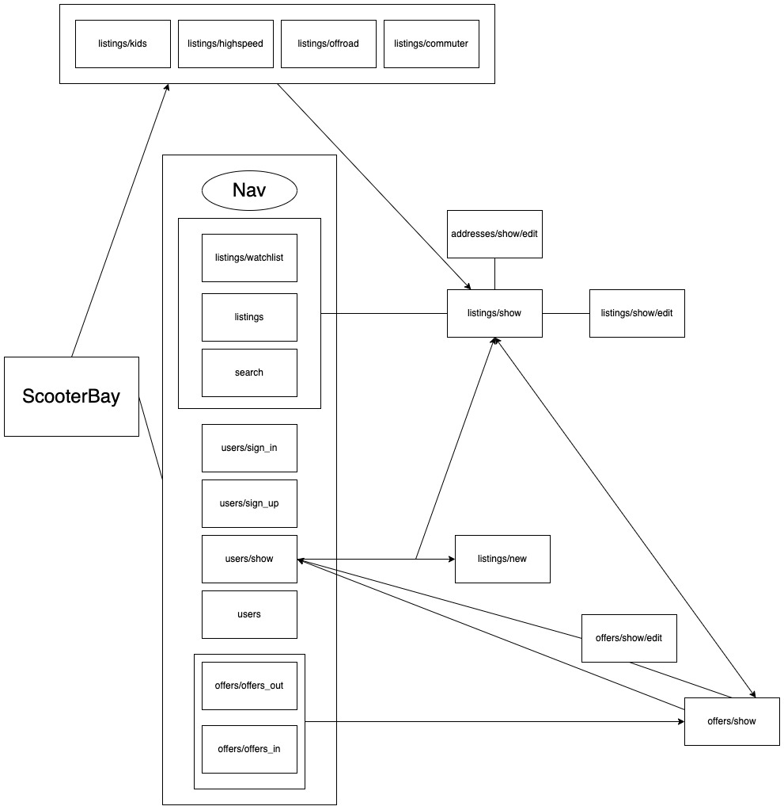

## Screenshots
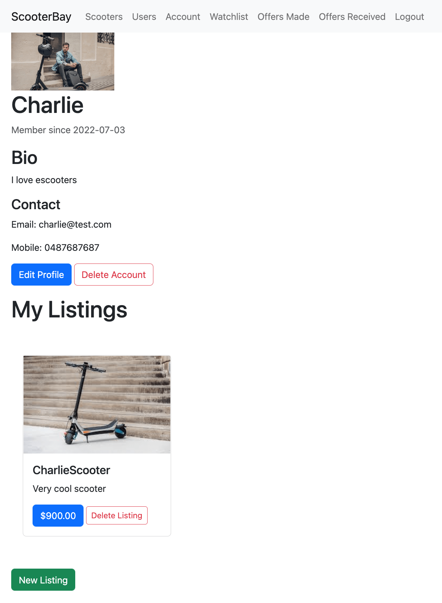
<br>
<hr>
<br>
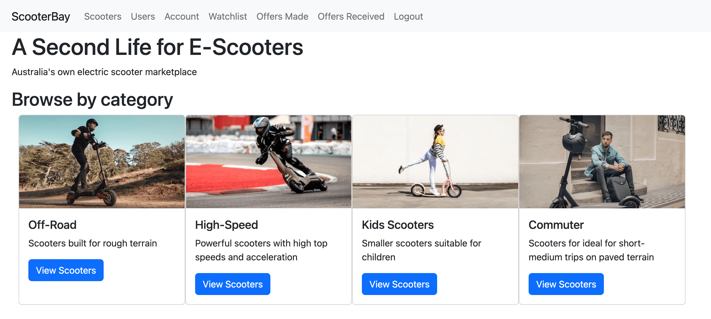
<br>
<hr>
<br>
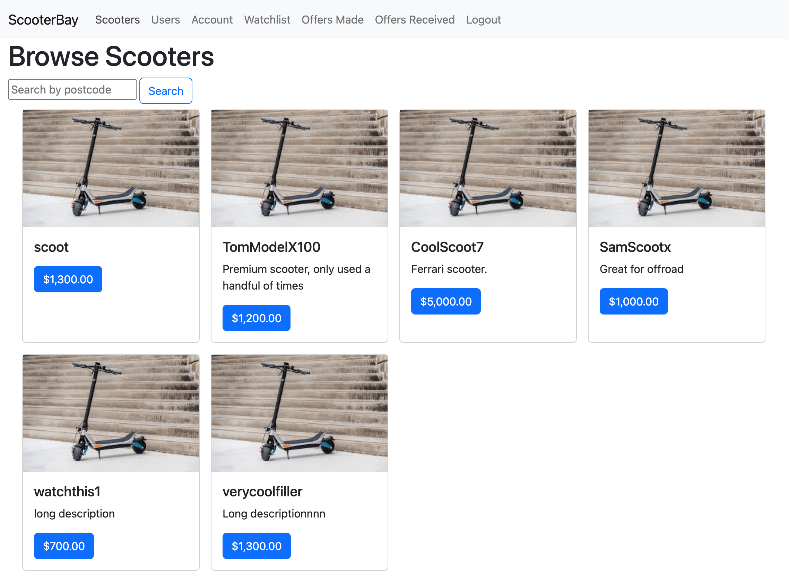
<br>
<hr>
<br>
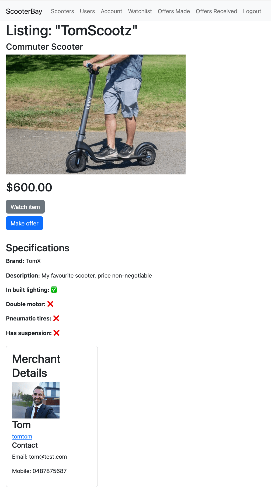
<br>
<hr>
<br>
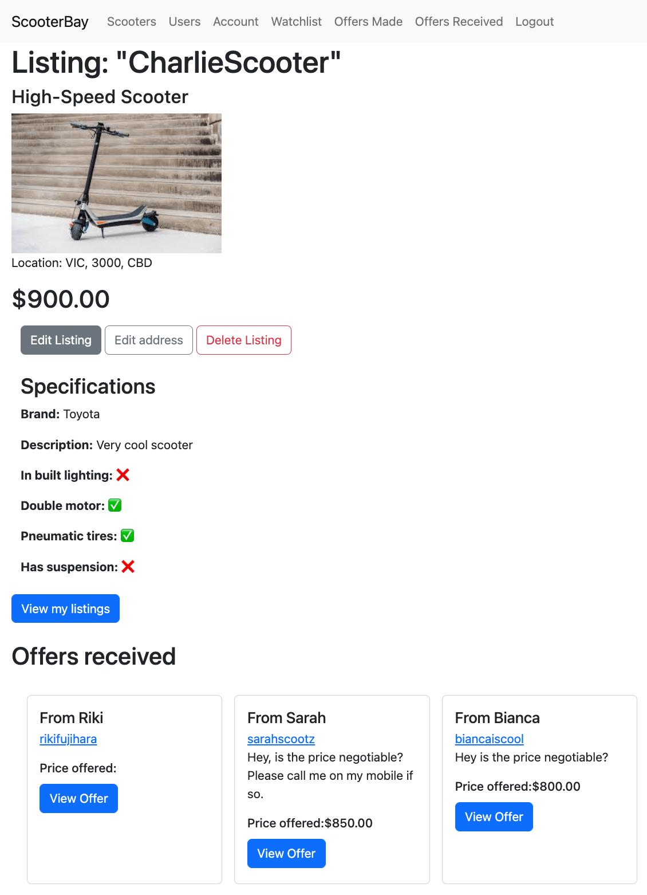
<br>
<hr>
<br>
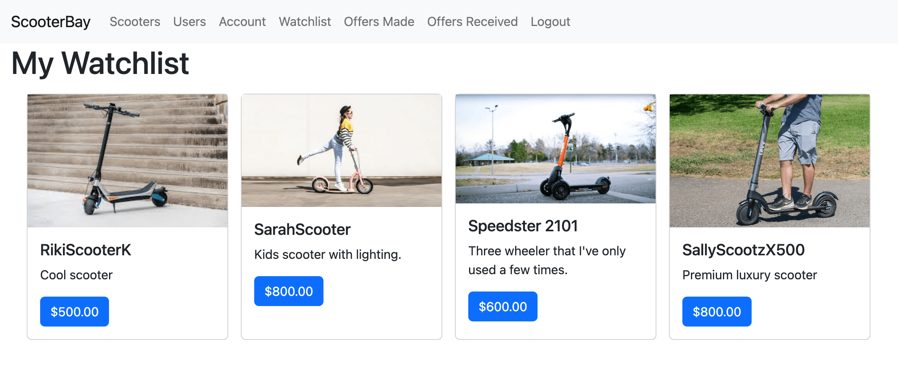
<br>
<hr>
<br>
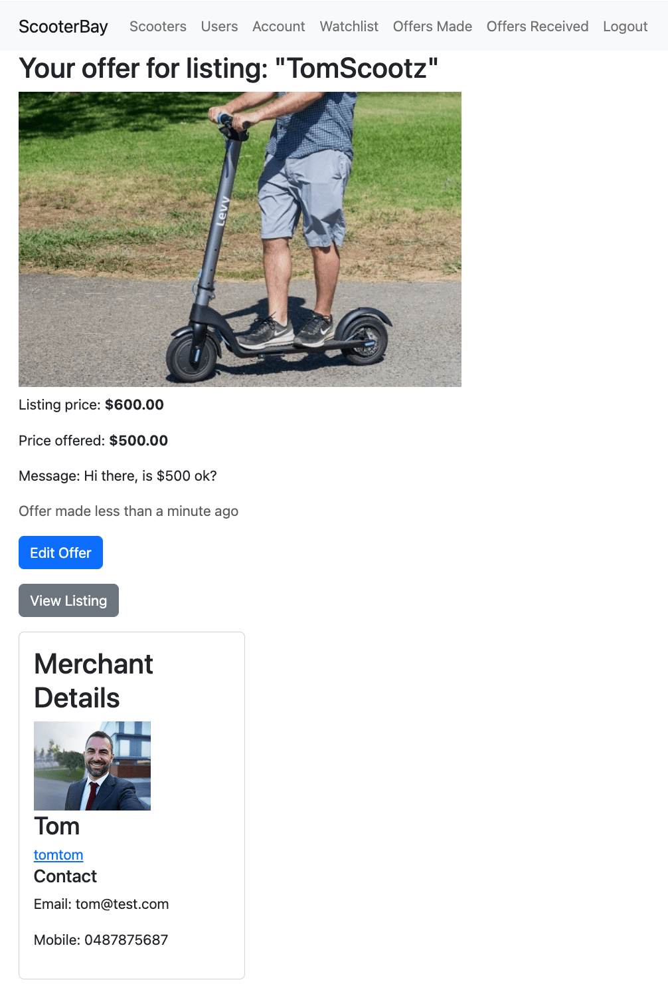
<br>
<hr>
<br>
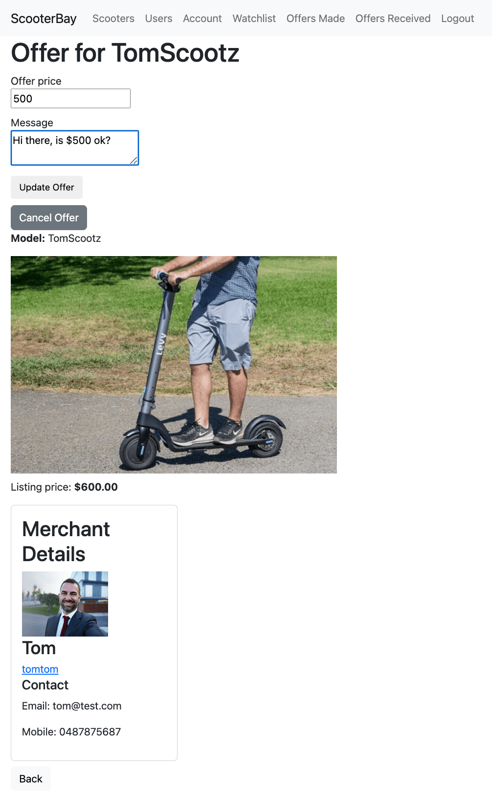
<br>
<hr>
<br>
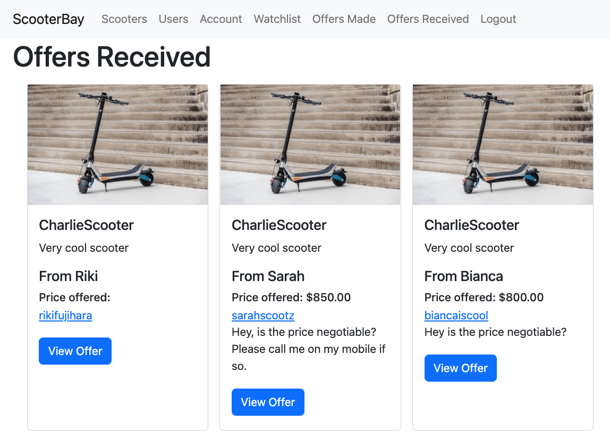
<br>
<hr>
<br>
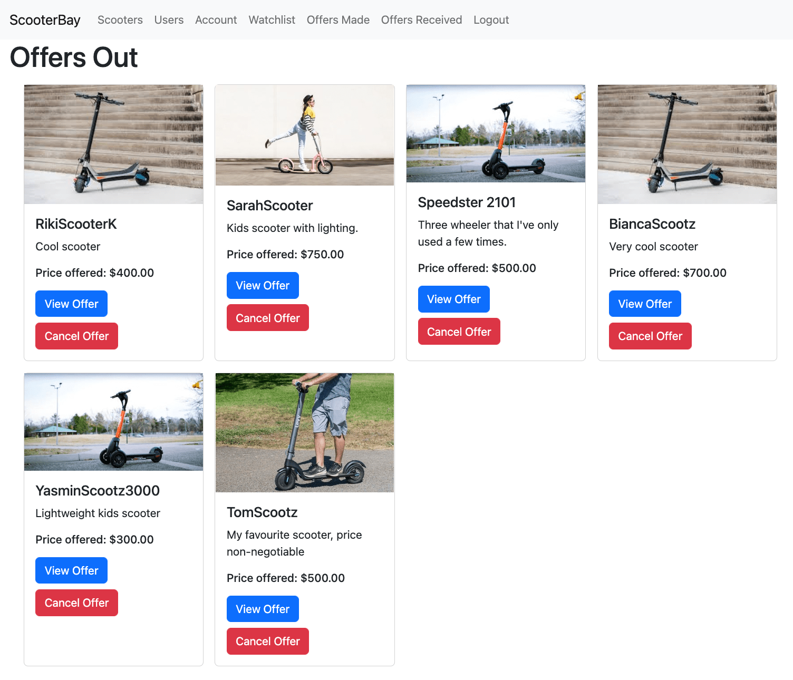
<br>
<hr>
<br>
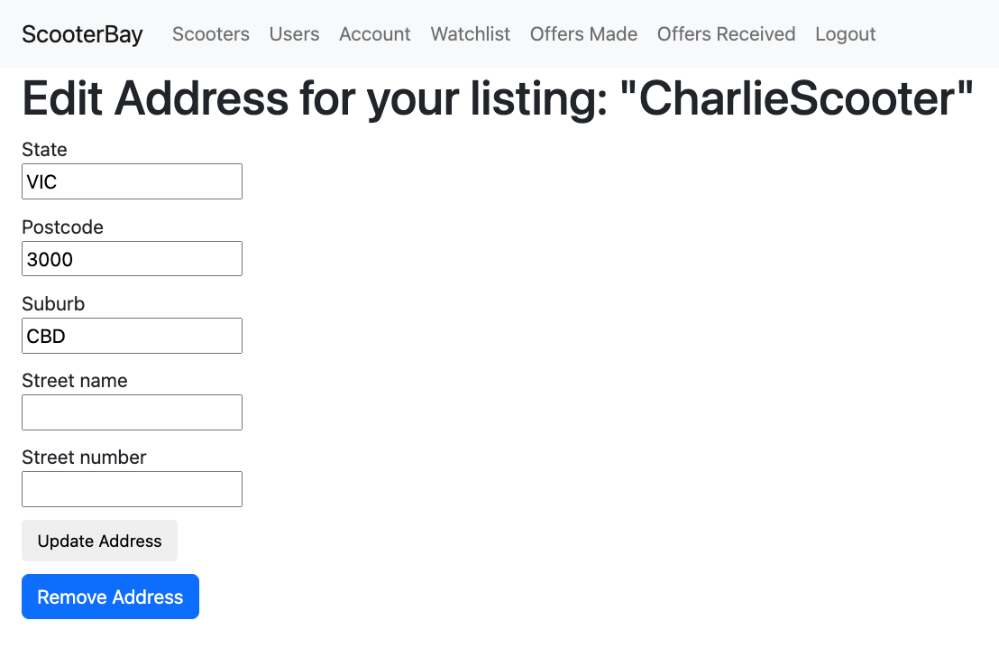

### Target Audience
The target audience of ScooterBay is those wishing to save money on the cost of aquiring an E-Scooter and those wanting to sell their E-Scooters.

### Tech Stack

- Ruby on Rails
- HTML
- CSS/SCSS (BootStrap)
- Heroku
- AWS S3 Storage

ScooterBay is built on Ruby on Rails as its overarching framework. The view consists of html.erb files rendered by the browser. Scss adds styling to the html pages and the site is deployed to Heroku. Image uploads and static images are stored and accessed using AWS S3.

## User Stories

### Browsing listings by category
Scooter buyers want to browse listings by category so that they can find the specific type of scooter that they are interesting in buying.

### Browsing listings by postcode
Scooter buyers want to browse listings by postcode so that they can find scooters that are geographically close to them.

### Editing profile - profile picture
ScooterBay users want to set their profile pictures so that they can express their individuality to the other users on the site and add credibility to their profile.

### Editing profile - bio
ScooterBay users want to add bios to their profiles so that they can express their individuality to the other users on the site and show some of their personality.

### Editing profile - deleting account
ScooterBay users want to have the option to delete their account so that if they no longer need to use ScooterBay, they can rest assured that all of their data is not kept on ScooterBay's storage services.

### Listings - creating listings
E-Scooter sellers want to create listings so that they can be found by potential buyers.

### Listings - editing listings
E-Scooter sellers want to attach an image to their listings so that buyers can see the scooter visually to aid the model and description.


E-Scooter sellers want to specify an address for their listing so that they can increase the chance for their listing to be found by nearby buyers.

### Listings - deleting listings
E-Scooter sellers want to delete their listings so that they don't receive enquiries on listings that they've sold in person or no longer wish to sell.

### Watchlist - adding to watchlist
E-Scooter buyers want to add listings to their watchlist so that they can save listings that they are interested in without making an offer.

### Watchlist - adding to watchlist
E-Scooter buyers want to remove listings from their watchlist so that they can get rid of listings that they are no longer interested in.

### Offers - making offers
E-Scooter buyers want to make offers on other people's listings so that they can create the opportunity to suggest a price along with a message, so they can buy the listing at the listing price or at a bargain if the buyer agrees.

### Offers - editing offers
E-Scooter buyers want to edit offers they have made on others' listings so that they can edit the message or offer price on their offer in case they change their mind.

### Offers - deleting offers
E-Scooter buyers want the option to delete their offers in case they change their minds and no longer want to purchase the listing.

### Offers - receiving offers
E-Scooter sellers want to receive offers on their listings so they can see who is interested in buying their listing.

## Wireframes
### Profile Page
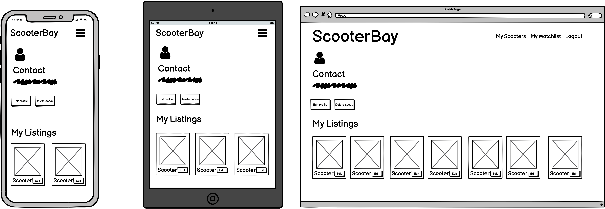

### Edit Listing Page


### Home Page
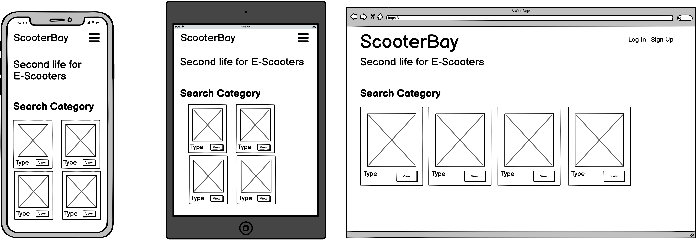

### New Listing Page


### Search Page


### Show Page


### Watchlist Page
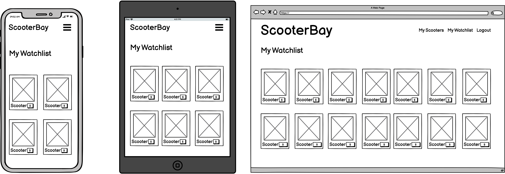

## ERD
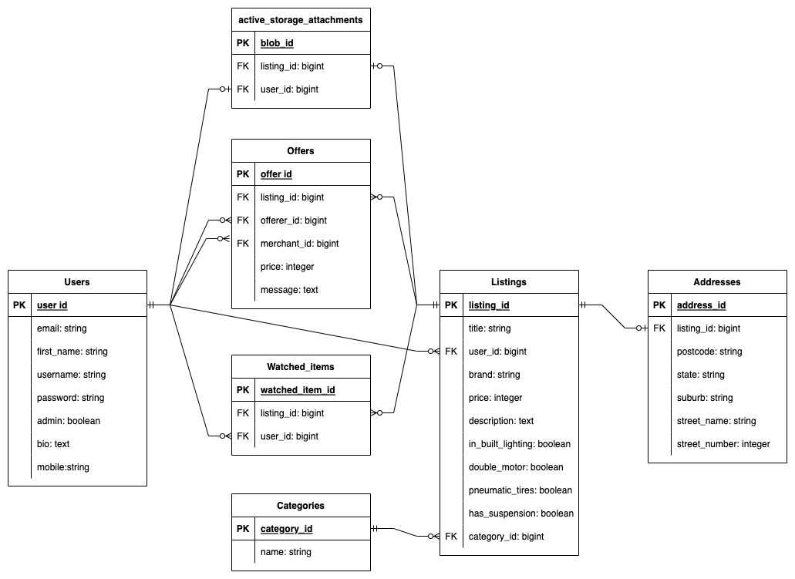

## Third party services
### Devise
Devise is a ruby gem developed to handle user authentication in Rails apps. Devise is modular - Scooterbay utilises database authentication and input validations. Devise fits in perfectly with Rails' MVC architecture and handles much of the abstractions of user authentication. The views for user authentication such as login and signup pages can be generated in order to edit and use them. These views are already linked to a controller which is not accessible by default, although ScooterBay's source code accesses the User controller in order to add some custom functionality. Devise was used to create the User model which formed the basis of the user experience and allowed greater ease of development. 

### Bootstrap
ScooterBay is styled using Bootstrap. The Bootstrap components were accessed via their open-source website <a href='https://getbootstrap.com/'>here</a>. The stylesheets and JavaScript script are accessed via a CDN (content delivery network) instead of a bundled gem or NPM. CSS classes are then applied to various elements to apply the Bootstrap styles. The use of Bootstrap greatly improved speed of development as it allowed more time to focus on the logic of the views rather than the specific visual attributes of elements such as borders, padding, margin and the like.

### Heroku and AWS S3
AWS s3 was used to store uploaded images. The deployed app was given access rights via credentials stored in the app's environment variables. Since the app is deployed on the free tier of Heroku's hosting, the server is turned off after being idle, which means any stored images would be lost. Therefore it was important to have the images stored using an external service.

## High Level Components (Abstractions)

What is MVC?

Rails applications like ScooterBay use what's called the 'model view controller' (MVC) design pattern. MVC breaks down the application's structure into three main components which handle specific tasks.

### Model
The model represents the data and relationships of the application. The models in Scooterbay include the following:

- User
- Listing
- WatchedItem
- Address
- Offer
- Category

### View

The view handles what is displayed to the user, which includes rendering content and receiving input. The primary views of ScooterBay include:

- User
- Listing
- Offer
- Address

It wasn't necessary to include views for each model listed above. For example, the WatchedItems model was just created to store the relationship between Listings and Users - the controller action of creating the WatchedItem simply creates a new instance by assigning foreign keys on the click of a button in a Listings view - therefore there's no need to display or edit the actual WatchedItem instance in any of the views - it's simply used later to retrieve the desired Listing instances to display to the user.

### Controller

The controller is the brains of the design pattern. The view goes through the controller to retrieve data from the model. Controllers process input from the user via the view then perform the relevant actions which may include redirects or interactions with the database via the model.

The controllers generated for ScooterBay include:

- Addresses
- Listings
- Users
- Offers
- Pages
- WatchedItems

Each generated model has an accompanying controller to dictate the actions that are performed on those models' instances - such as creating new instances of the models or deleting them from the database. The Pages controller does not gave an accompanying model as it doesn't have any relevant instances to be maniuplated in the database - it's simply used to display a view (the homepage).

### Inheritance

Ruby has something called classes which are like blueprints or templates for objects. Classes can 'inherit' properties from other classes called superclasses, which greatly impacts Rails applications because it ties in very closely with its MVC architecture.

Each generated Controller and Model inherits from superclasses. Generated Controllers all inherit from a superclass called ActionController - which gives the newly generated controller all of its properties and pre-built functionality. 
Generated Models all inherit from a superclass called AplicationRecord - this allows the newly generated Model to use all of its properties and pre-built functionality.


This inheritance provides the functionality to the custom controllers and models which allow for the modular, conventional development methodology of MVC.


## Model relations

The models in ScooterBay have various Activerecord associations.

### Listing
<strong>belongs_to :user</strong>

The Listing model references instances of the User model through the 'belongs_to' relationship.

<strong>belongs_to :category</strong>

The Listing model references instances of the Category model through the 'belongs_to' relationship.

<strong>has_one :address, dependent: :destroy</strong>

The Listing model is referenced by instances of the Address model through a has_one relationship. The Address instances referencing Listings are dependent on the Listings so are deleted when the referenced Listing is deleted.

<strong>has_one_attached :picture, dependent: :destroy</strong>

Listings reference active_storage attachments via a has_one_attached relationship. The active storage instances referencing Listings are dependent on the Listings so are deleted when the referenced Listing is deleted.

### Address
<strong>belongs_to :listing</strong>
Instances of the Address model each reference an instance of a Listing model through a 'belongs_to' relationship.

### Category
<strong>has_many :listings</strong>
Instances of the Category model are each referenced by zero to many instances of the Listings model through a has_many relationship.

### Offer
<strong>belongs_to :listing</strong>

Instances of the Offer model each belong to one instance of the Listing model through a belongs_to relationship.

<strong>belongs_to :offerer, foreign_key: "offerer_id", class_name: "User"</strong>


<strong>belongs_to :merchant, foreign_key: "merchant_id", class_name: "User"</strong>

### User
<strong>has_one_attached :avatar, dependent: :destroy</strong>

Users reference active_storage attachments via a has_one_attached relationship. The active storage instances referencing Users are dependent on the Users so are deleted when the referenced User is deleted.

<strong>has_many :listings, dependent: :destroy</strong>

Users are referenced by instances of the Listings model through a has_many relationship. The Listings are dependent on Users so are deleted when the referenced User is deleted.

<strong>has_many :watched_items, dependent: :destroy</strong>

Users are referenced by instances of the WatchedItem model through a has_many relationship. The WatchedItems are dependent on Users so are deleted when the referenced User is deleted.

<strong>has_many :offers_in, foreign_key: "merchant_id", class_name: "Offer", dependent: :destroy
</strong>

<strong>
  has_many :offers_out, foreign_key: "offerer_id", class_name: "Offer", dependent: :destroy
</strong>

Users are referenced by instances of the Offer model via a has_many relationship. The Offers are dependent on the Users so are deleted when the referenced User is deleted.

### WatchedItem

<strong>belongs_to :user</strong>

Instances of the WatchedItem model reference instances of the User model through a belongs_to relationship.

<strong>belongs_to :listing</strong>

Instances of the WatchedItem model reference instances of the Listing model through a belongs_to relationship.

## Database relations

The following tables in ScooterBay's database included the following relations.

### Users
Users have the following relationships implemented in the database:

- 'one mandatory to one optional' relationship with activestorage attachments. Activestorage attachments must have one User but Users can have one or zero active storage attachments.

- '* two mandatory to optional many' relationship with Offers. Offers must have Users but Users can have zero to many Offers. * When an offer is created it will reference two different Users, one as a merchant and one as an offerer

- 'one mandatory to optional many' relationship with Listings.  Listings must have one User but Users can have zero or many Listings.

- 'one mandatory to optional many' relationship with WatchedItems. WatchedItems must have one User but Users can have no WatchedItems.

### Active storage attachments

Active storage attachments have the following database relationships.

- 'one mandatory to one optional' relationship with Users. Activestorage attachments must have one User but Users can have zero or one active storage attachment.

- 'one mandatory to one optional' relationship with Listings. Activestorage attachments must have one Listing but Listings can have zero or one active storage attachment.

### Offers

Offers have the following database relationships.

- '*two mandatory to optional many' relationship with Users. Offers must have Users but Users can have zero or many Offers. * When an offer is created it will reference two different Users, one as a merchant and one as an offerer

- 'one mandatory to optional many' relationship with Listings.  Offers must have one Listing but Listings can have zero or many Offers.

### Listings

Listings have the following database relationships.

- 'one mandatory to optional many' relationship with Offers.  Offers must have one Listing but Listings can have zero or no Offers.

- 'one mandatory to optional many' relationship with Users.  Listings must have one User but Users can have many or no Listings.

- 'one mandatory to one optional' relationship with Activestorage attachments. Activestorage attachments must have one Listing but Listings can have zero or one active storage attachment.

- 'one mandatory to one optional' relationship with Addresses. Addresses must have one Listing but Listings can have zero or one Address.

- 'one mandatory to optional many' relationship with WatchedItems.  WatchedItems must have one Listing but Listings can have zero or no WatchedItems.

- 'one mandatory to many optional' relationship with Categories. Listings must have one category but Categories can have zero or many Listings.

### Addresses

Addresses has the following database relationship.

- 'one optional to one mandatory' relationship with Listings. Addresses must have one Listing but Listings can have zero or one Address.

### WatchedItems

WatchedItems have the following database relationships.

- 'one mandatory to optional many' relationship with Listings.  WatchedItems must have one Listing but Listings can have zero or no WatchedItems.

- 'one mandatory to optional many' relationship with Users.  WatchedItems must have one User but Users can have zero or many WatchedItems.

### Categories

Categories has the following database relationship.

- 'one mandatory to many optional' relationship with Listings. Listings must have one category but Categories can have zero or many Listings.


## Database Schema design

``` Ruby

ActiveRecord::Schema.define(version: 2022_07_08_115340) do

  # These are extensions that must be enabled in order to support this database
  enable_extension "plpgsql"

  create_table "active_storage_attachments", force: :cascade do |t|
    t.string "name", null: false
    t.string "record_type", null: false
    t.bigint "record_id", null: false
    t.bigint "blob_id", null: false
    t.datetime "created_at", null: false
    t.index ["blob_id"], name: "index_active_storage_attachments_on_blob_id"
    t.index ["record_type", "record_id", "name", "blob_id"], name: "index_active_storage_attachments_uniqueness", unique: true
  end

  create_table "active_storage_blobs", force: :cascade do |t|
    t.string "key", null: false
    t.string "filename", null: false
    t.string "content_type"
    t.text "metadata"
    t.string "service_name", null: false
    t.bigint "byte_size", null: false
    t.string "checksum", null: false
    t.datetime "created_at", null: false
    t.index ["key"], name: "index_active_storage_blobs_on_key", unique: true
  end

  create_table "active_storage_variant_records", force: :cascade do |t|
    t.bigint "blob_id", null: false
    t.string "variation_digest", null: false
    t.index ["blob_id", "variation_digest"], name: "index_active_storage_variant_records_uniqueness", unique: true
  end

  create_table "addresses", force: :cascade do |t|
    t.bigint "listing_id", null: false
    t.string "state"
    t.string "postcode"
    t.string "suburb"
    t.string "street_name"
    t.integer "street_number"
    t.datetime "created_at", precision: 6, null: false
    t.datetime "updated_at", precision: 6, null: false
    t.index ["listing_id"], name: "index_addresses_on_listing_id"
  end

  create_table "categories", force: :cascade do |t|
    t.string "name"
    t.datetime "created_at", precision: 6, null: false
    t.datetime "updated_at", precision: 6, null: false
  end

  create_table "listings", force: :cascade do |t|
    t.string "title"
    t.string "brand"
    t.integer "price"
    t.text "description"
    t.boolean "in_built_lighting", default: false
    t.boolean "double_motor", default: false
    t.boolean "pneumatic_tires", default: false
    t.boolean "has_suspension", default: false
    t.bigint "user_id", null: false
    t.datetime "created_at", precision: 6, null: false
    t.datetime "updated_at", precision: 6, null: false
    t.bigint "category_id", null: false
    t.index ["category_id"], name: "index_listings_on_category_id"
    t.index ["user_id"], name: "index_listings_on_user_id"
  end

  create_table "offers", force: :cascade do |t|
    t.bigint "listing_id", null: false
    t.bigint "offerer_id", null: false
    t.bigint "merchant_id", null: false
    t.datetime "created_at", precision: 6, null: false
    t.datetime "updated_at", precision: 6, null: false
    t.integer "price"
    t.text "message"
    t.index ["listing_id"], name: "index_offers_on_listing_id"
    t.index ["merchant_id"], name: "index_offers_on_merchant_id"
    t.index ["offerer_id"], name: "index_offers_on_offerer_id"
  end

  create_table "users", force: :cascade do |t|
    t.string "email", default: "", null: false
    t.string "encrypted_password", default: "", null: false
    t.string "reset_password_token"
    t.datetime "reset_password_sent_at"
    t.datetime "remember_created_at"
    t.string "username"
    t.string "first_name"
    t.boolean "admin", default: false
    t.datetime "created_at", precision: 6, null: false
    t.datetime "updated_at", precision: 6, null: false
    t.text "bio"
    t.string "mobile"
    t.index ["email"], name: "index_users_on_email", unique: true
    t.index ["reset_password_token"], name: "index_users_on_reset_password_token", unique: true
  end

  create_table "watched_items", force: :cascade do |t|
    t.bigint "user_id", null: false
    t.bigint "listing_id", null: false
    t.datetime "created_at", precision: 6, null: false
    t.datetime "updated_at", precision: 6, null: false
    t.index ["listing_id"], name: "index_watched_items_on_listing_id"
    t.index ["user_id"], name: "index_watched_items_on_user_id"
  end

  add_foreign_key "active_storage_attachments", "active_storage_blobs", column: "blob_id"
  add_foreign_key "active_storage_variant_records", "active_storage_blobs", column: "blob_id"
  add_foreign_key "addresses", "listings"
  add_foreign_key "listings", "categories"
  add_foreign_key "listings", "users"
  add_foreign_key "offers", "listings"
  add_foreign_key "offers", "users", column: "merchant_id"
  add_foreign_key "offers", "users", column: "offerer_id"
  add_foreign_key "watched_items", "listings"
  add_foreign_key "watched_items", "users"
end

```

## How tasks are allocated and tracked in the project

Trello was the main tool for planning and tracking tasks in building ScooterBay.

### MVP
The process was to first plan out the requirements for building an MVP.

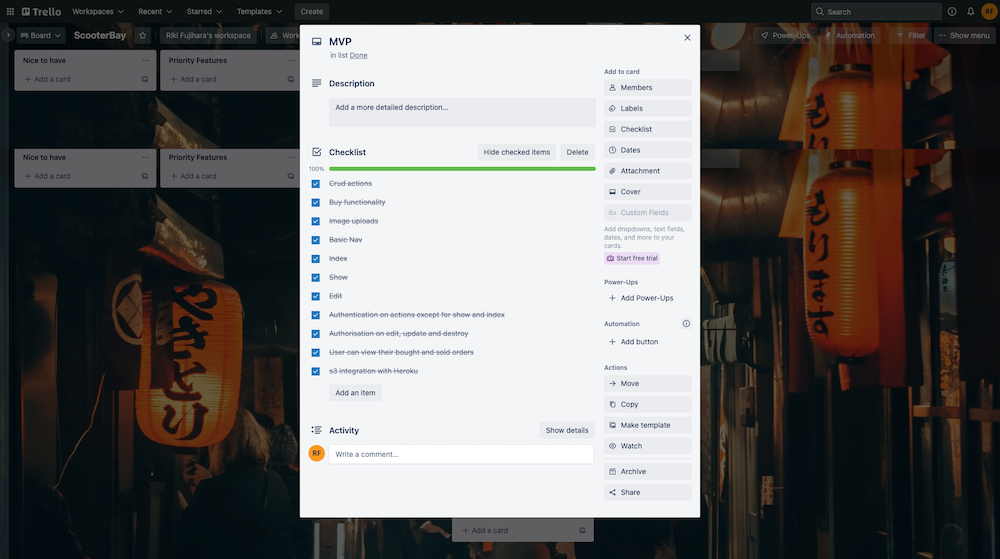

### Offer system

With an MVP complete, the functionality of ScooterBay was extended to include an offer system - this functionality was planned using user stories to ensure that efforts were focused on fulfilling the end-user's needs.

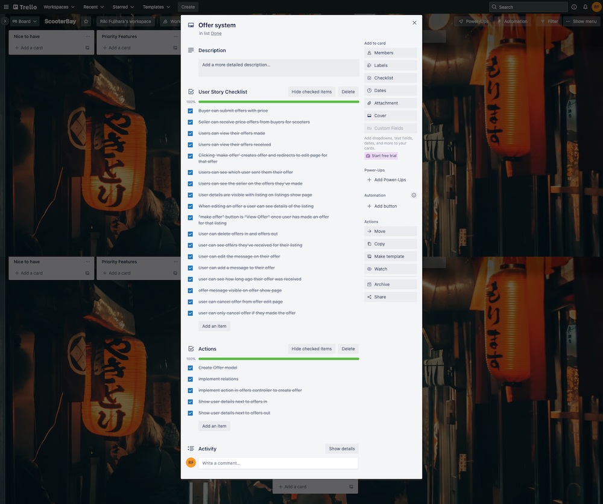

### Search functionality

With the offer system implemented, the functionality of ScooterBay was extended to facilitate search functionality - this functionality was planned using a simple user story and an action checklist.

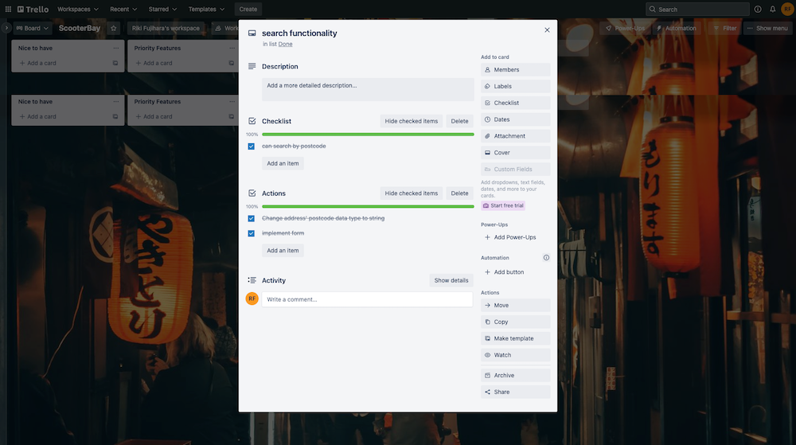

### Filtering functionality

With the search functionality implemented, the functionality of ScooterBay was extended to facilitate search filtering based on category - this functionality was planned using a simple user story and an action checklist.

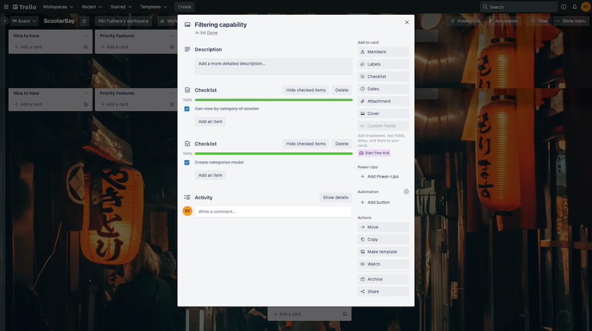

### Addresses

With the filtering functionality implemented, the functionality of ScooterBay was extended to include addresses on listings - this functionality was planned using a user stories and an action checklist.

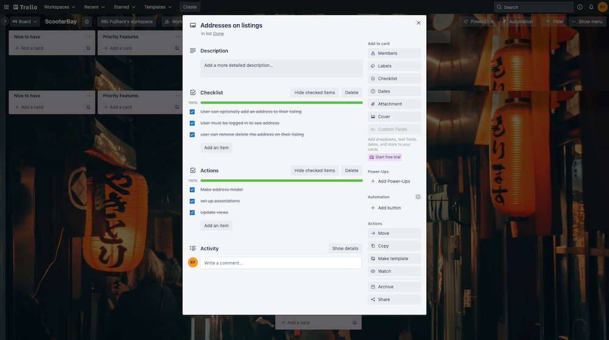

### Contact details on listings

With the addresses implemented, the functionality of ScooterBay was extended to facilitate the display of contact details on listings - this functionality was planned using a user story and an action checklist.

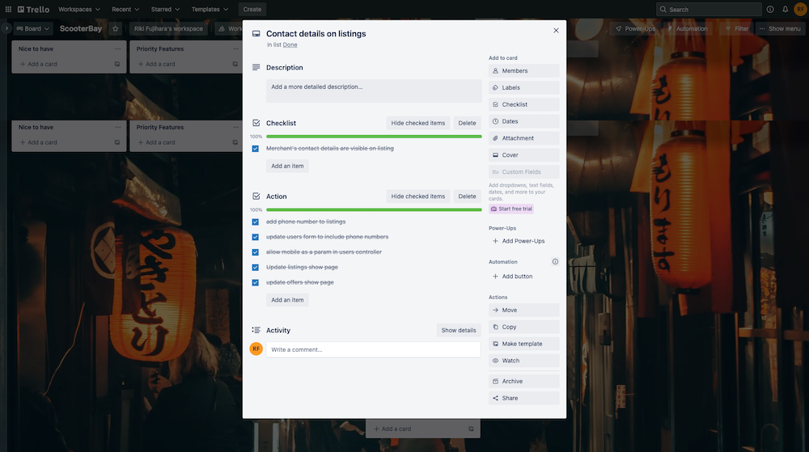

### Watchlist

With the contact detail displays implemented, the functionality of ScooterBay was extended to include a watchlist system - this functionality was planned using a user stories and an action checklist.

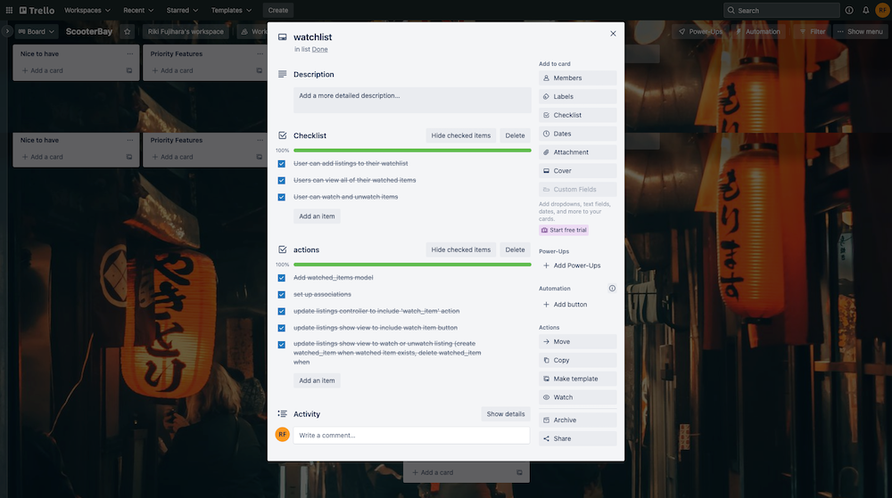

### User profile page

With the watchlist system implemented, the functionality of ScooterBay was extended to include user profile pages - this functionality was planned using a user stories and an action checklist.

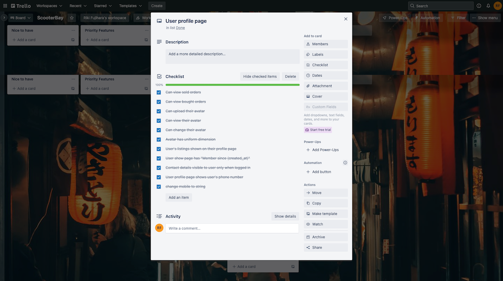

### Admin controls

With the user profile page implemented, the functionality of ScooterBay was extended to include admin controls - this functionality was planned using a user stories.

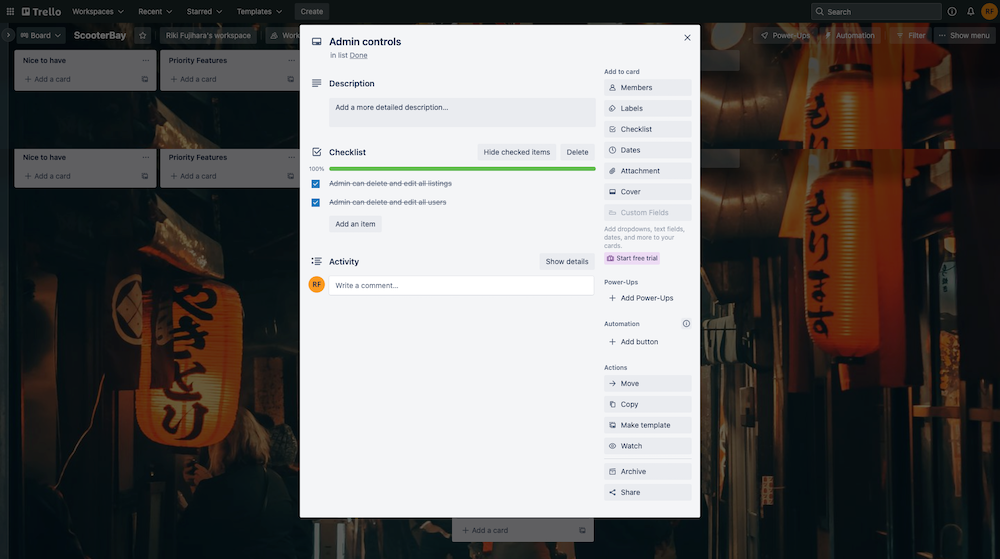

### Data validation

With the desired functionality of ScooterBay implemented, data validation was planned using a checklist of each controller as a checklist heading and their form inputs as checklist items.

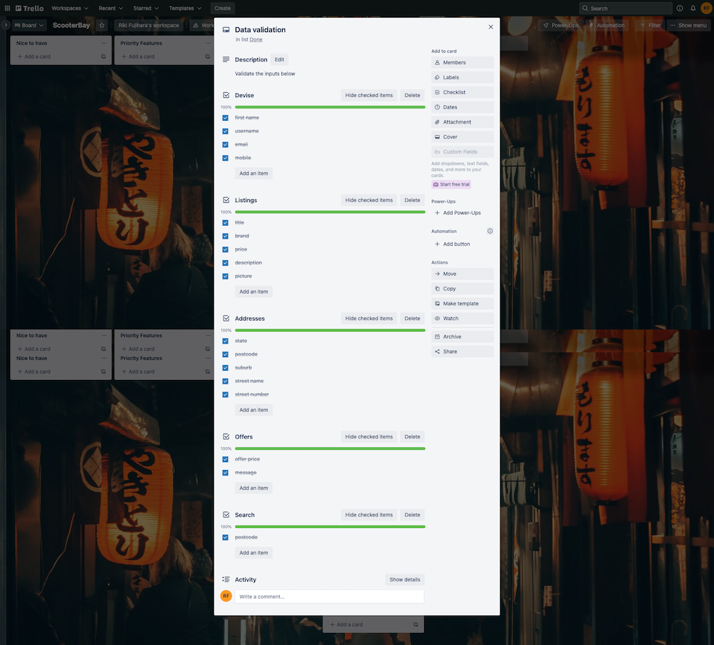


### link to Trello board <a href='https://trello.com/invite/b/KVZvpHL0/9aacbe6e24c654b43d825dc38447d555/scooterbay'>here</a>